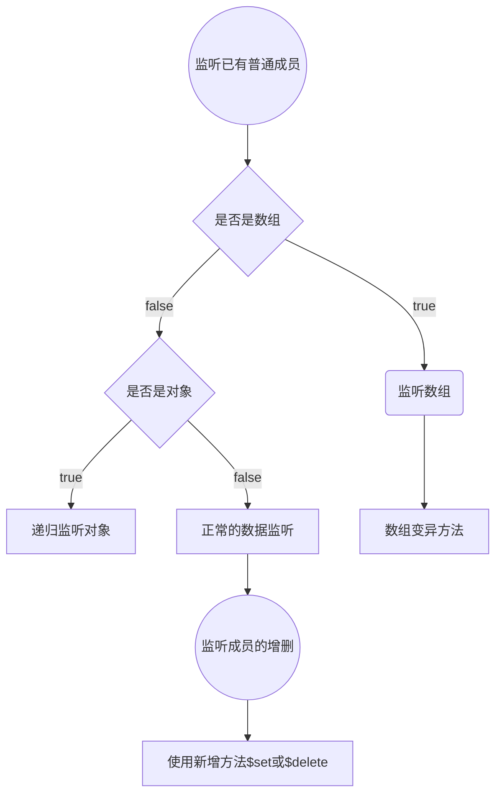

1. 监听 data 中的每一个成员的改变 (Object.defineProperty)
2. 成员是对象，对象中的成员 (递归)
3. 成员是数组，改写 data 对象的原型 指向 改变后的 Array.prototype
4. 成员是对象，那么它的增删也应该被监听到。增加 \$set 和 $delete 方法。

```mermaid
graph TB
observerNormal((监听已有普通成员)) --> ifArray{是否是数组}
ifArray --true--> observerArray(监听数组)
ifArray --false--> ifObject{是否是对象}
ifObject --true--> makeObjFunc[递归监听对象]
ifObject --false--> normalDataObserver[正常的数据监听]
observerArray --> makeArrayFunc[数组变异方法]
normalDataObserver --> observerObject((监听成员的增删)) --> makeObjectFunc[使用新增方法$set或$delete]
```